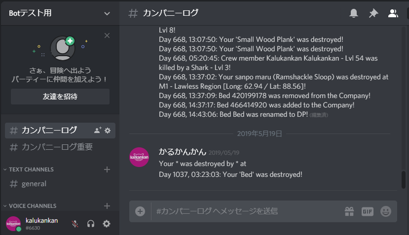
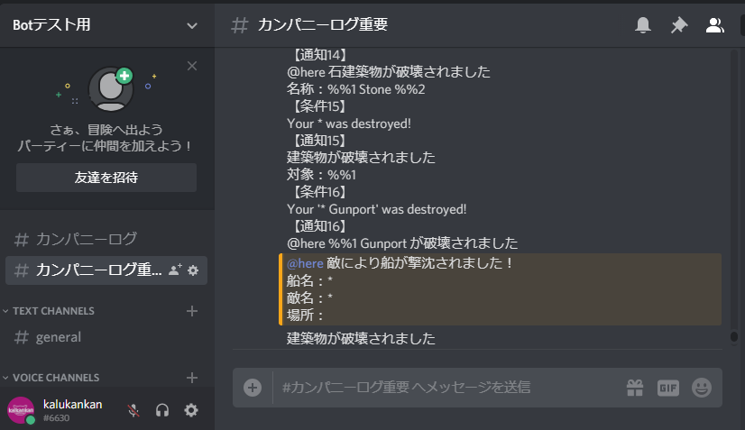
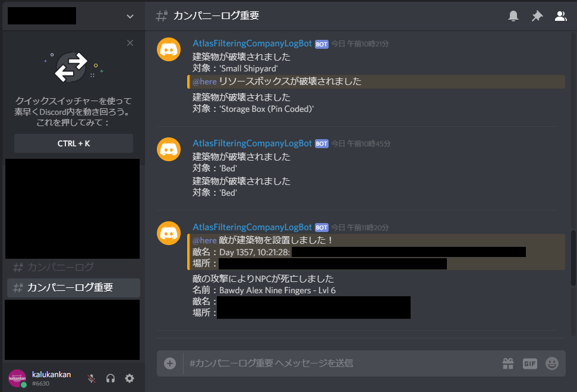

# atlas-filtering-companylog-discord-bot
Atlas Webhookにて取得したカンパニーログをフィルタリングし重大なメッセージを@here通知するボットです。  
This bot filters company logs obtained by Atlas Webhook and reports important messages.

## イメージ

実運用サンプル

## 機能概要
- カンパニーログチャンネル(※1)にメッセージが送信された際、通知条件と一致するメッセージであれば通知チャンネル(※2)にメッセージを通知します
- 通知チャンネルでコマンドを入力することでBotを操作することができます
- 通知条件や通知するメッセージの内容はコマンドから登録/修正/削除することができます

※1 カンパニーログチャンネル：Atlas Webhook にてカンパニーログが送信されるチャンネル  
※2 通知チャンネル：本Botがメッセージを送信するチャンネル  

## 開発環境
- PyCharm 2018.3.3 (Community Edition)
- Python 3.6 
  (Python 3.7 は discord.py 0.16.12 が対応していないため)

## 実行方法
1. 下記参考しAtlas Webhookにてカンパニーログをディスコードで受け取れるよう設定
    - https://gamerch.com/atlas/entry/69996
1. 下記参考し自分のBot作成
    - https://qiita.com/1ntegrale9/items/9d570ef8175cf178468f
1. settings.ini の bot_token に作成したBotのトークンを貼り付ける
1. settings.ini の watch_channel に1で設定したカンパニーログチャンネル名、notice_channel に通知時のチャンネル名を設定
1. ディスコードに notice_channel で設定したチャンネルを作成
1. あとはおもむろに実行してBotが起動しましたメッセージを出力したらOK

## 現在確認されている不具合
- /add notice で%１つだけ入力した状態でコマンド実行するとBotが反応しない
  - %は正しく２つ入力することで正常に動作します
